

# Factory Virtualization
Factory Virtualization adds an entirely new approach to production and logistics,
allowing your factory to grow past all known limits. Discover a way to compile
your production lines into production templates. Replace millions of physical
machines with virtualization clusters that execute your templates for real production.
Clusters are assembled from specialized buildings. Add more crafting power by
building more virtualization mainframes, add more storage by building more storage
units. Complete the mod by building a digital empire that will make the biggest
Space Age megabases look like simple starter bases. Progression starts on Aquilo.
You can add the mod to an existing save (don't forget to back it up).

## Development stage
This is the alpha version of the mod, and it hasn't been extensively playtested yet.
That said, it **works properly 99%** of the time during my testing.
I wrote every single line of the script myself and double-checked everything,
so I'm pretty confident it's not going to break itself apart.
I haven't run into any data-breaking issues for a long time
(these can be really dangerous). However, **it's theoretically possible**
for something to go terribly wrong. I highly suggest enabling autosaves.
Also, creating a manual backup every 5–10 hours or so definitely wouldn't hurt.

## Solving the UPS problem
When building a large factory, you inevitably end up with many copies of
the same production line doing exactly the same thing. Every single entity in every
single production line has to be updated individually. Every single tick. Factorio
is incredibly well-optimized and can handle tens of thousands of working entities
without causing problems with UPS. However, in the process of expanding the factory,
you will eventually reach a point when your UPS drops below 60 and the game becomes
unpleasant to play. At this point, most players abandon their factories.

But it does not have to be this way! Factory Virtualization is the solution to this
problem. It introduces three optimization concepts that allow your factory to grow
almost indefinitely:
1. Take your production line and **compile** it into a mathematical model (a
**production template**) with defined inputs and outputs. Now you can **execute**
this template in $O(1)$ time, regardless of the number of entities in your production
line.
2. Templates are executed in **virtualization clusters**. Clusters are capable of
executing an assigned template multiple times in parallel. This takes exactly the
same amount of processing time as running a single instance. You can think of
this as having several copies of your production line working inside a single cluster.
3. Clusters execute the assigned template once every 60 ticks (1 second), which is
obviously more efficient than doing it every tick. _Execution is distributed evenly
across ticks to eliminate lag spikes._

## Production templates
A template is a mathematical model of a production chain containing four key
components:
1. **Inputs** — resources consumed per second.
2. **Outputs** — products generated per second.
3. **Construction cost** — materials required to "construct" the template. Think of it
as a capital investment: machines, inserters, belts that would normally form the
physical line.
4. **Virtualization overhead** — additional electrical power consumed per second.

## Virtualization surfaces
Specialized surfaces used for compilation of your production lines into production
templates. You should think of a **vsurface** as a virtual sandbox. Any production
chain can be constructed here for free. The following tasks are performed automatically:
ghosts are revived, deconstruction and upgrade requests fulfilled, item requests
are satisfied. Just place your blueprints and they will be constructed automatically.

A vsurface can be generated empty (with lab tiles) or using the **mapgen**
of any planet, which yields a surface containing resources. The size of the
generated surface can vary from 1x1 to 1024x1024 tiles. Creating larger surfaces or surfaces with resources requires significantly more infrastructure and research.
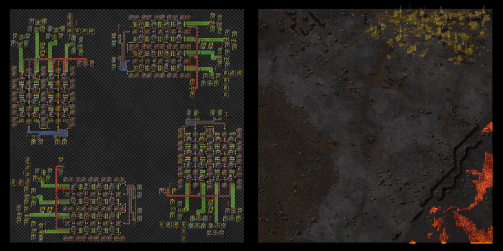

To compile a new template, your production chain must be constructed on a virtualization surface, after which you can start the compilation process. Once it successfully finishes, a compiled template will be created.

To define inputs and outputs of your template, **template item/fluid/energy IOs**
are used. These buildings work exclusively on virtualization surfaces and have two modes of operation:
1. **Source mode** — the port materializes resources and records them as template inputs.
2. **Sink mode** — the port destroys resources and records them as template outputs.

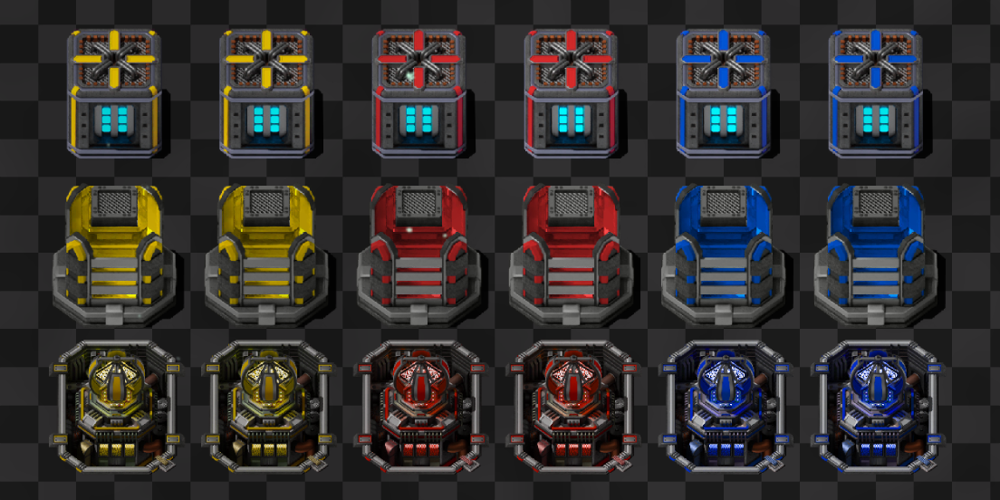

## Template validation
To prevent various exploits of the template mechanics, the system performs periodic
validation checks on the compiling vsurface. It verifies the material balance
for every resource. There are four components considered:
1. **Inputs** — resources spawned by IO ports during compilation.
2. **Outputs** — resources destroyed by IO ports during compilation.
3. **Produced** — resources produced on this vsurface (production statistics).
4. **Consumed** — resources consumed on this vsurface (production statistics)

Validation is passed if **Input + Produced == Output + Consumed**. A relative
deviation of less than 1% is considered acceptable.
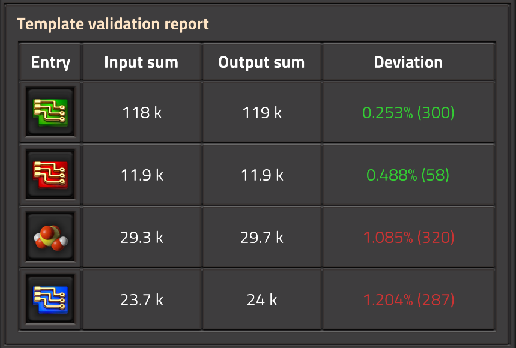

## Virtualization infrastructure
Compiling production templates is a demanding task that requires a serious infrastructure. This infrastructure must be built on Aquilo, where the extreme cold provides the necessary cooling for quantum processors.

The **Template Control Center** is the heart of your digital empire;
the system cannot work without it, and you only need one. It is required for:
1. Creating and maintaining virtualization surfaces.
2. Compiling those surfaces into production templates.
3. Granting access to compiled templates.

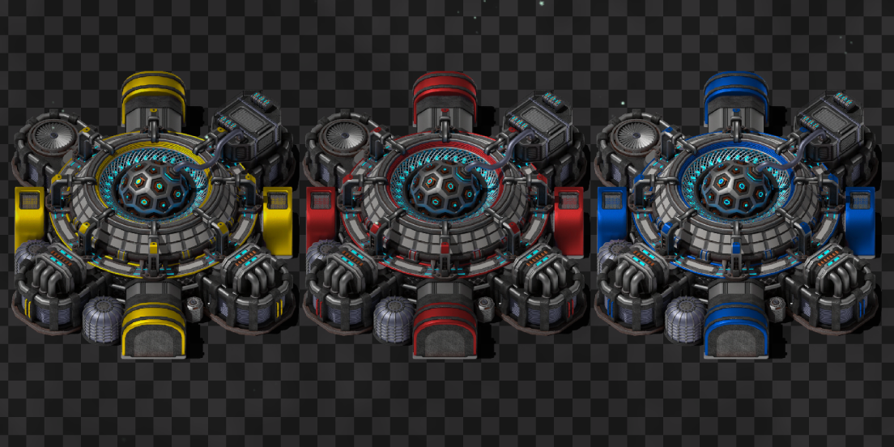

**Template computation arrays** are needed to produce **computation**, which
is required to sustain the existance of virtualization surfaces.
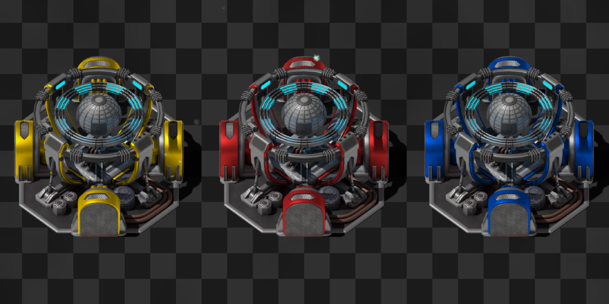

**Template access interfaces** provide virtualization clusters with access
to compiled templates.
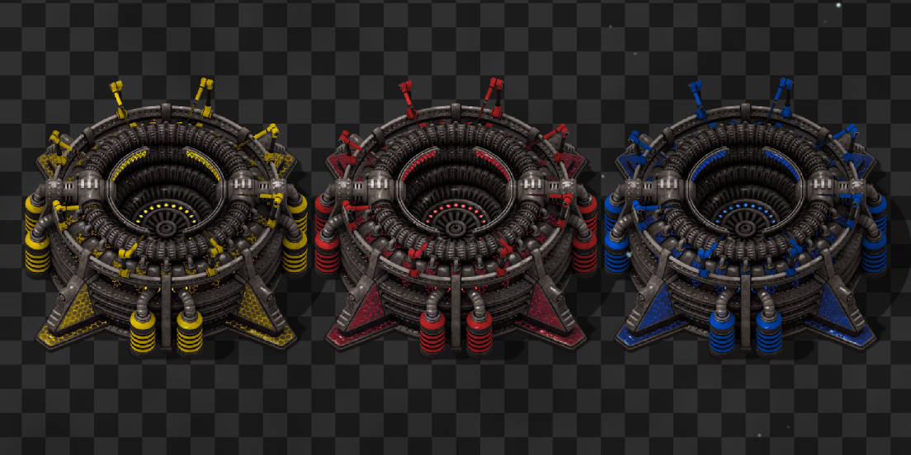

## Virtualization clusters
Clusters are simulated factories that produce resources by executing a production
template. They can consume and produce items, fluids, and electrical energy.
Clusters are assembled from specialized buildings, each with a unique role:

**Virtualization mainframes** provide **crafting power** to the cluster, allowing
it to execute more crafts in parallel. However, the required template construction materials must be provided before a mainframe becomes operational and contributes to the cluster.
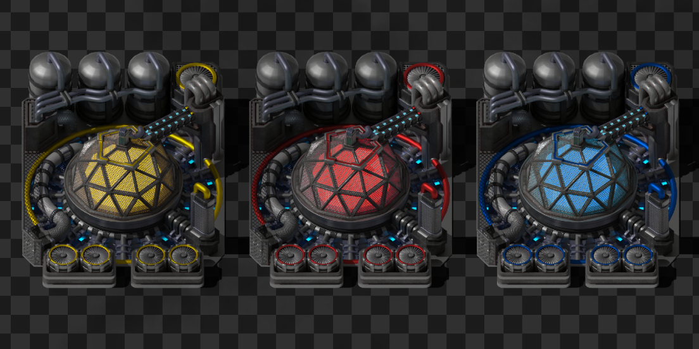

**Cluster storage units** increase the size of the cluster's internal buffers.
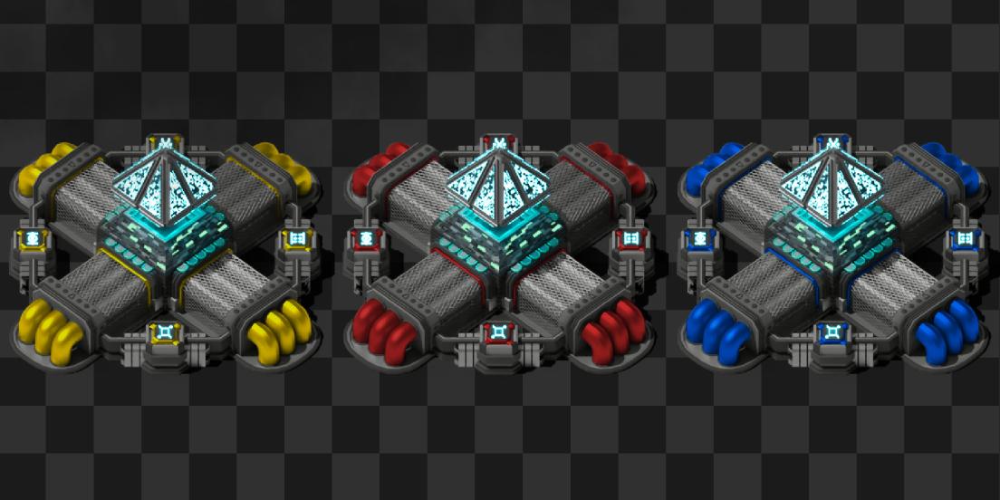

**Cluster item/fluid/energy IOs** are used to transfer resources between
the physical world and the internal buffers of the cluster.
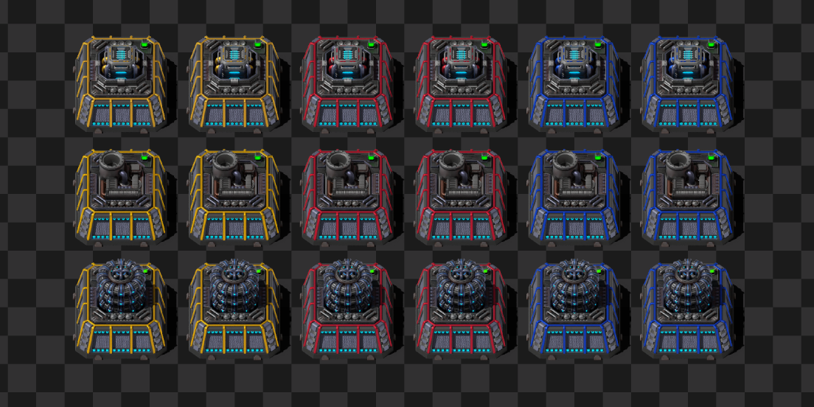

**Inter-cluster bridges** transfer resources directly from the output of one
cluster to the input of another. They can handle items, fluids, and energy with incredibly high transfer speeds. For example, a normal-quality MK1 bridge can transfer 1M items/s, 10M fluid/s, or 1TW of energy.
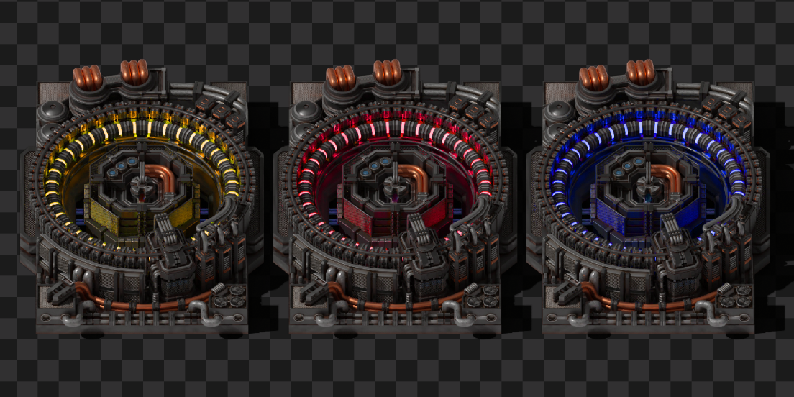

**Cluster overflow controllers** are used to void overflow the cluster's
output buffer. They feature a configurable overflow threshold and provide
incredibly high throughput.
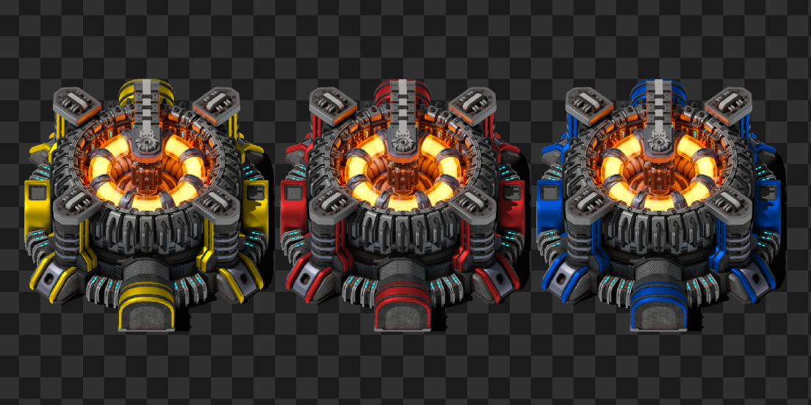

## Cluster efficiency
The energy consumption of a cluster depends not only on the template it
executes, but also on how spread out its members are. This
**decentralization loss** is an additional energy cost that scales
with the distance between cluster members. It is applied multiplicatively
to the base energy cost of template execution. The loss is proportional
to the average squared distance from each cluster member to the cluster's
center. The center is calculated as the weighted average of all member
positions. The loss does not scale with the number of members — only
their spacial distribution matters. This encourages you to build compact
clusters.

## Quality of life
Factory Virtualization introduces several deep and complex mechanics. To aid
you in the construction of your digital empire, the mod includes the
following quality-of-life features:

**Custom entity configuration alerts:** Most entities in this mod must be properly configured to operate. They may also have other specific working conditions. Alerts allow you to instantly see which entities require your attention.
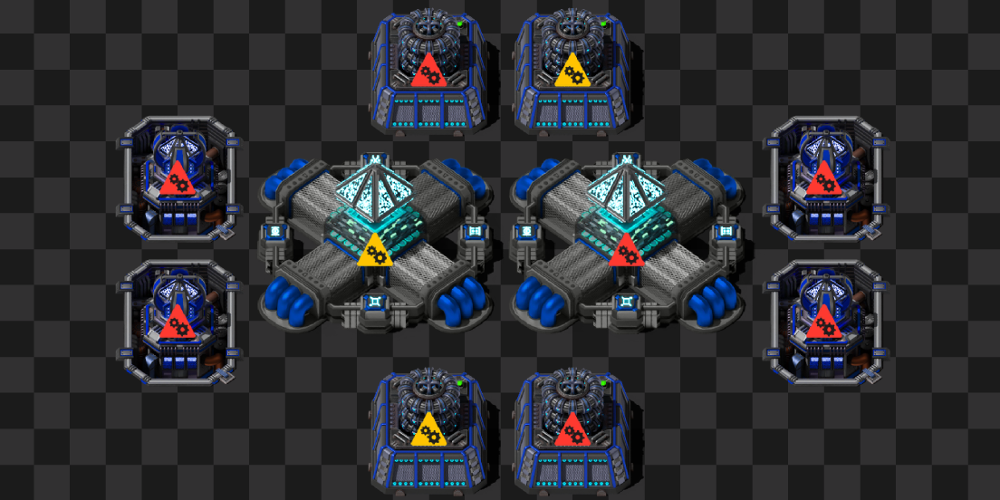

**Nearly 50 custom entity statuses:** These statuses allow you to
understand exactly why a specific entity is not working.
**Convenient custom GUI windows:** The main dashboard is packed with features.
Here are some of the key elements found in the **Clusters** tab:
1. **Cluster Members section:** Displays the total and operational counts
for each member type in a clear table. Each row includes a button that
automatically moves your camera to a non-operational building of that type.
2. **Cluster Performance section:** Allows you to track how efficiently
your cluster is currently performing.
3. **Input and output buffer details:** Uses color-coded bars to instantly
highlight production bottlenecks.
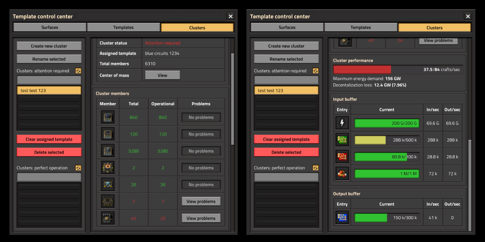

**13 Tips and Tricks:** Built-in in-game guides packed with additional mod-related information and useful insights.

## Compatability
This mod is fully compatible with multiplayer.

It should be compatible with any other mod, except:
1. Any mod that alters player forces. Everything related to vsurfaces, clusters, and other systems is bound to the "player" force. If your force is changed to something else, Factory Virtualization will not work properly. As a result, PvP team-on-team modes are not supported.
2. Any mod that heavily modifies surfaces. Clusters are bound to specific surfaces upon creation. If a surface is deleted, the associated cluster will be deleted as well.

## Commands
I haven't encountered any issues with the FV GUI recently,
however problems are possible. Especially since window
states persist when closed and reopened. To help you out, I've added
a debug command in case you ever get stuck. Running `/FV-reset-gui`
will close all existing FV windows and reset their states for all
players in the game.

## Credits
**PreLeyZero** — [Exotic Industries](https://mods.factorio.com/mod/exotic-industries)
(GNU GPLv3). Almost all sprites used in this mod were derived (tweaked, combined,
and recolored) from that project. In my opinion, they look awesome and perfectly
fit the theme of the mod.

**raiguard** — [Krastorio 2](https://mods.factorio.com/mod/Krastorio2) (GNU LGPLv3).
Sprites for the **Template access interfaces** were derived (tweaked and recolored)
from the texture of the **Intergalactic transceiver** in that project. This sprite
is also great and fits the building perfectly.

## Future plans
There are several features I would like to add to this mod, including:
1. The ability to compile space platforms into production templates.
Imagine how cool it would be if your promethium platforms **didn't cause UPS problems**.
2. The ability for clusters to produce research. This could allow you to reach
quadrillions of SPM (which is awesome) and make progression much more
interesting. Currently, I am limited by the fact that all labs must be
placed in the physical world. I am not entirely sure how this should be
implemented yet (e.g., as a separate cluster member with preconfigured
research capabilities, a preconfigured template unlocked by research,
or compiled like other templates but on a special kind of vsurface).
Let me know your thoughts on how to approach this.
3. Better QoL for entity configuration.
**Currently, copy-pasting with blueprints is fully supported**.
However, there is more that can be done to improve the experience,
such as supporting **undo/redo** and **left-click + right-click**
entity-to-entity copy-paste. This is much more complicated than
it looks and will take days at best to implement.
4. More QoL for entity configuration: a **selection tool**
(like an upgrade planner) that would allow you to configure all
selected entities at once. There are, again, many ways this could
be implemented. If you have any thoughts on how it should be done,
I would gladly hear them.
5. Better prototypes for entities. There are many small things that can
improve the experience: for example, various sounds (construction,
deconstruction, inventory sounds, working sounds, etc.).
6. Animations for all entities. **Currently, there are no animations**.
This is very complicated and time-consuming. It requires creating many
3D models and their animations from scratch. It also requires complex
runtime scripts to control these animations (even if I had the assets
right now, they wouldn't work without additional logic).
7. A version of this mod that does not depend on Space Age.
8. Anything else I see fit. If you have any ideas, you are welcome
to share them with me.

Apart from improving this mod, I want to create a modpack with deep progression that will include Factory Virtualization. This is a complex task, and currently, I am not sure what it will look like. Maybe something like GTNH, but in Factorio.

## Support the project
The **alpha version** of this project took 3 months of full-time, everyday work
to create. If you enjoy the mod and want to support its further development,
there are a few ways you can help:

1. **Contribute on GitHub:** If you'd like to directly contribute to the project
(help with code, sprites, animations, sounds, etc.), open an "issue" on GitHub so
we can discuss how you can help. You can also contribute by reporting
any bugs you encounter.
[GitHub repository](https://github.com/BipkaPrime/factory-virtualization)
2. **Shape the future of the mod:** By following my
**[Boosty page](https://boosty.to/bipkaprime)** (completely for free), you can follow dev blogs, participate in community polls, suggest your ideas, and vote on which features from the roadmap I should prioritize next.
3. **Support development financially:** If you have the means and want to help
the project grow, financial contributions on
[Boosty](https://boosty.to/bipkaprime) are highly appreciated.
They will allow me to dedicate more time to the project.

Whether you support the project with a donation, a line of code, or a bug report
— every bit of help counts. Thank you for playing, and let's make Factory
Virtualization awesome together!